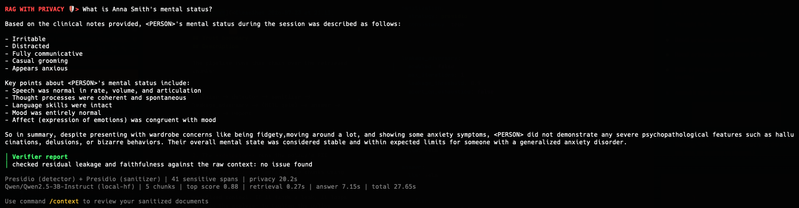

# Privacy mode

Privacy mode adds a multi-agent privacy pipeline between MMORE's retriever and the answer model, so only cleaned and checked context ever reaches the LLM.

It runs at query time only: the vector DB keeps the raw corpus unchanged, and the pipeline works on the top-k chunks retrieved for each request.

Command:

```bash
mmore rag --config-file examples/rag/config.yaml --privacy examples/rag/privacy.yaml
```

We recommend using the mmore TUI, where privacy mode is available in both RAG and RAG CLI.



## Description

The pipeline runs this chain over the retrieved chunks:

```
analyzer -> detector -> sanitizer -> leakage_adversary -> (HITL gate) -> answer -> verifier -> report
```

1. The **analyzer** picks the privacy domain and creates a policy for that request.
2. The **detector** runs the policy's PII engine over each raw chunk.
3. The **sanitizer** rewrites the chunks using the chosen strategy.
4. The **leakage adversary** attacks the sanitized context. If it finds a leak, it loops back to the analyzer to tighten the policy (limited by `leakage_adversary.max_iterations`). When an escalation changes only the sanitization side, detection is skipped and the previous spans are reused. If the loop exhausts its iterations without the adversary clearing the context, the request is aborted as unsafe by default; set `leakage_adversary.abort_on_exhaustion: false` to instead proceed to the gate with the best-effort sanitized context.
5. The **HITL gate** is the trust boundary. With `interactive: false` it approves automatically and the graph finishes in one pass. With `interactive: true` it pauses before any context leaves for the answer model: in `local` mode a terminal prompt shows the PII-free summary and asks to approve, revise (with optional feedback), or reject; in `api` mode the gate auto-approves with a startup warning. Revise feedback can be descriptive: the analyzer maps it onto the available tools (detection engine, sanitization strategy, threshold level, presidio anonymization operator, a custom rewrite instruction for the synthetic-rewrite LLM, or a custom detection instruction for the LLM detector).
6. The **answer model** sees only the sanitized context, the sanitized query, and the domain prompt. It never reads the raw chunks or the raw query.
7. The **verifier** checks the answer for leftover PII and faithfulness, and raises type and count warnings to guide the user.

## Configuration

`privacy.yaml` is loaded directly as `PrivacyConfig`, so its fields sit at the top level (no `privacy:` wrapper). See `examples/rag/privacy.yaml` for a full example. Main fields:

- `domain`: `global`, `healthcare`, or `humanitarian`. Leave it out to let the analyzer guess it.
- `context_analyzer.llm`: the analyzer's LLM. The detector, sanitizer, adversary, and verifier fall back to it when they don't set their own.
- `interactive`: the HITL gate. In `local` mode it prompts in the terminal (queries run one at a time); in `api` mode it auto-approves with a warning. Set `false` for unattended runs.
- `detection.engine`: one engine, either `presidio`, `gliner`, `llm`, or `openai_filter`.
- `sanitization.strategy`: `token_masking`, `entity_replacement`, `synthetic_rewrite`, or `presidio`.
- `sanitization.encryption_key`: AES key used when the `presidio` strategy runs its `encrypt` operator (e.g. after gate feedback asks for encryption). Unlike masking or hashing, encryption is reversible: whoever holds this key can decrypt the values in the sanitized context later. Without it a random key is generated per run and discarded, so the encrypted values are as unrecoverable as a hash.
- `leakage_adversary.strategies`: which attack vectors the adversary probes. Omit to run all (`residual_span`, `quasi_identifier`, `structural_reid`, `context_reconstruction`, `membership_inference`). Pass a subset (e.g. `[residual_span, quasi_identifier]`) to narrow and speed up the probe.
- `leakage_adversary.abort_on_exhaustion`: whether to abort the request as unsafe when the adversary never clears the context within `max_iterations` (default `true`). Set `false` to proceed to the gate with the best-effort sanitized context instead.
- `answer.llm`: any `LLMConfig` backend (API or self-hosted/vLLM).
- `verifier.checks` and `verifier.warn_threshold`: the advisory checks run over the answer. Omit `checks` to run all (`residual_leakage`, `faithfulness`). You can also pass a subset.

## Code layout

Everything lives under `src/mmore/privacy/`:

| Path | Role |
| --- | --- |
| `config.py` | `PrivacyConfig` and its enums: what a `privacy.yaml` is loaded into |
| `pipeline.py` | the graph wiring |
| `runner.py` | runs the compiled graph for one query|
| `gate_ui.py` | terminal front-end for the HITL gate (raw/sanitized difference) |
| `report_builder.py` | turns the final graph state into a `ReportRecord` |
| `agents/` | one module per graph node: `analyzer`, `detector`, `sanitizer`, `adversary`, `gate`, `answer`, `verifier`, plus the shared `BaseAgent`, `PrivacyState` and tool registry |
| `schemas/` | the data formats in the pipeline: `policy`, `risk`, `leakage`, `verification`, `report` |
| `detection/` | the PII detection engines, each registered as an agent tool |
| `sanitization/` | the sanitization strategies, each registered as an agent tool |
| `domains.py` | the per-domain profiles (label set, prompts, and defaults) |
| `model_cache.py` | pipeline cache so engines and agents share loaded models |
| `dspy_llm.py` | DSPy backend: builds an LM from an `LLMConfig` for specific output formats |
| `ux.py` | reports each agent's stage to the RAG progress display |

## Report schema

Each request adds one `ReportRecord`, shown on the RAG output as `privacy_report`:

| Field | Meaning |
| --- | --- |
| `request_id`, `timestamp` | request identity |
| `domain` | resolved privacy domain |
| `detection_engine` | engine used |
| `detection` | span count and per-entity-type counts |
| `sanitization_strategy` | strategy applied |
| `adversary_iterations`, `human_iterations` | policy escalations triggered by the adversary agent vs. by the user |
| `gate_outcome` | `approved`, `re-looped`, `aborted`, or `rejected` |
| `answer_backend`, `answer_model` | which model answered |
| `verifier_warnings` | verifier warnings as kind and count |
| `verifier_checks_run`, `verifier_checks_failed` | which advisory checks ran and which errored |
| `hitl_events` | list of gate interactions, one per human decision (each with its decision and any written revise feedback) |
| `sanitized_query` | the query after sanitization |
| `stage_seconds` | time spent per agent |
| `outcome` | `returned`, `returned-with-warnings`, or `aborted-unsafe` |

## See also

- [RAG](../getting_started/rag.md)
- [LLM as a judge](llm_as_a_judge.md)
